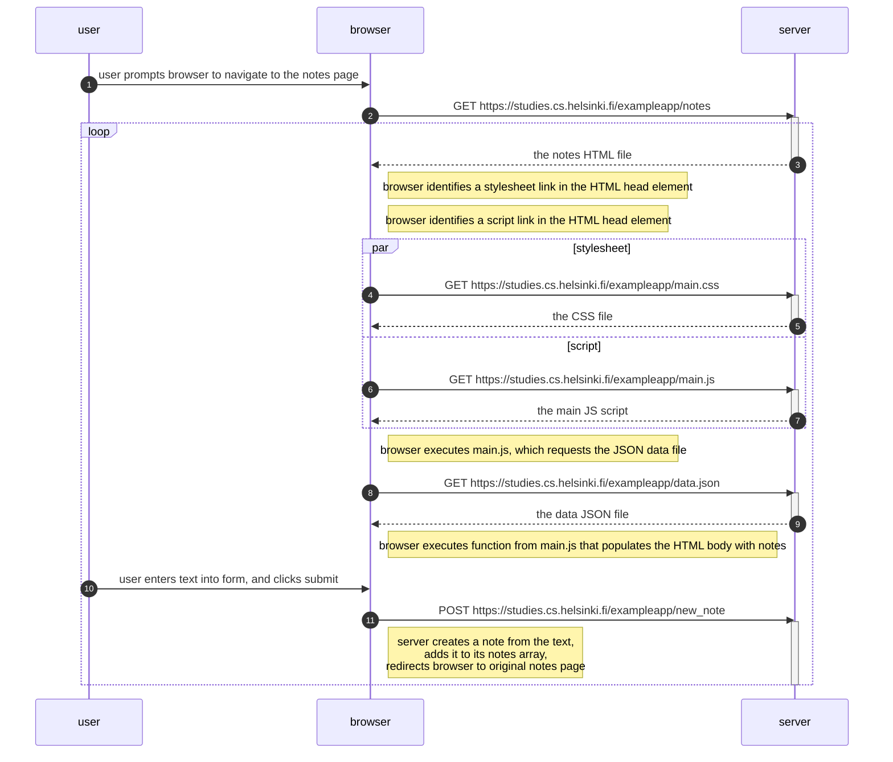

# exercise 0.4

## diagram

```mermaid
sequenceDiagram
    autonumber
    participant user
    participant browser
    participant server
    
    user ->> browser: user prompts browser to navigate to the notes page
    
    browser ->> server: GET https://studies.cs.helsinki.fi/exampleapp/notes

    activate server
    loop
    server -->> browser: the notes HTML file
    deactivate server

    Note right of browser: browser identifies a stylesheet link in the HTML head element
    Note right of browser: browser identifies a script link in the HTML head element
    
    par stylesheet

    browser ->> server: GET https://studies.cs.helsinki.fi/exampleapp/main.css
    activate server
    server -->> browser: the CSS file
    deactivate server
    
    and script

    browser ->> server: GET https://studies.cs.helsinki.fi/exampleapp/main.js
    activate server
    server -->> browser: the main JS script
    deactivate server
    
    end
    
    Note right of browser: browser executes main.js, which requests the JSON data file

    browser ->> server: GET https://studies.cs.helsinki.fi/exampleapp/data.json
    activate server
    server -->> browser: the data JSON file
    deactivate server
    
    Note right of browser: browser executes function from main.js that populates the HTML body with notes
    
    user ->> browser: user enters text into form, and clicks submit
    
    browser ->> server: POST https://studies.cs.helsinki.fi/exampleapp/new_note
    activate server
    
    Note right of browser: server creates a note from the text,<br> adds it to its notes array,<br> redirects browser to original notes page
    
    end

    deactivate server
    
```

