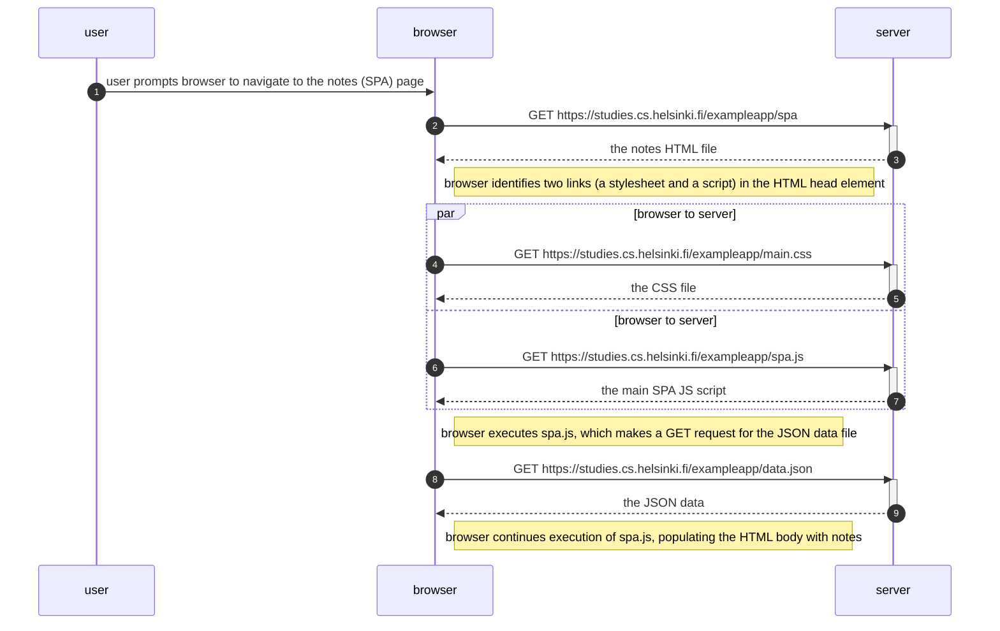

# exercise 0.4

## diagram

```mermaid
sequenceDiagram
    autonumber
    participant user
    participant browser
    participant server
    
    user ->> browser: user prompts browser to navigate to the notes (SPA) page
    
    browser ->> server: GET https://studies.cs.helsinki.fi/exampleapp/spa
    activate server
    server -->> browser: the notes HTML file
    deactivate server

    Note right of browser: browser identifies two links (a stylesheet and a script) in the HTML head element
    
    par browser to server

    browser ->> server: GET https://studies.cs.helsinki.fi/exampleapp/main.css
    activate server
    server -->> browser: the CSS file
    deactivate server

    and browser to server

    browser ->> server: GET https://studies.cs.helsinki.fi/exampleapp/spa.js
    activate server
    server -->> browser: the main SPA JS script
    deactivate server
    
    end
    
    Note right of browser: browser executes spa.js, which makes a GET request for the JSON data file

    browser ->> server: GET https://studies.cs.helsinki.fi/exampleapp/data.json
    activate server
    server -->> browser: the JSON data
    deactivate server
    
    Note right of browser: browser continues execution of spa.js, populating the HTML body with notes

```

